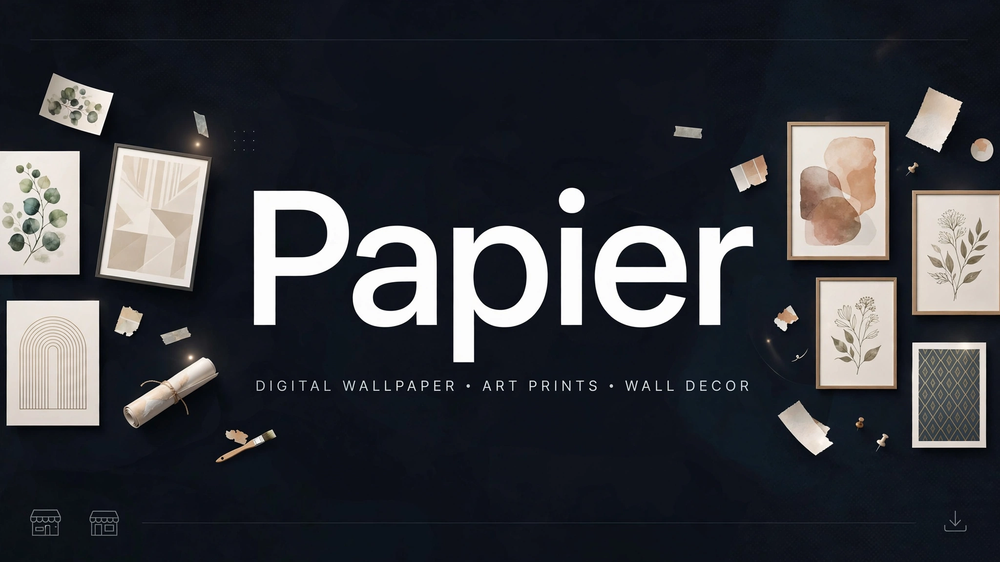
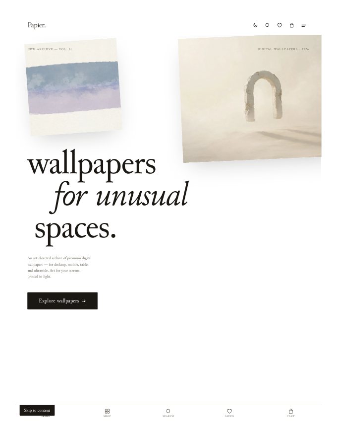

# Papier — Wallpapers for unusual spaces

> ## Status: 🟢 Completed
>
> <progress value="95" max="100"></progress>
> **Progress: 95%** — Full storefront works end to end; production build verified clean.

<p align="center">
  
</p>


## Screenshots

<p align="center">
  
  <br />
  <em>Homepage — art-directed wallpaper store.</em>
</p>


> Repository: `Geltrax69/Crazy_Wallpaper` · Live brand: **Papier**

## What it is

A digital wallpaper storefront: an art-directed, editorial, minimal shop for buying and downloading original wallpapers. White canvas, oversized Junicode typography, floating artwork, restrained color. It's a single-page React app with client-side routing — Home, Shop, Categories, Collections, Product detail, Search, Cart, Checkout, Downloads, Favorites, About, License, FAQ, and Contact pages — driven by a static, data-driven catalog in `src/data/`. State (cart, favorites, orders, theme) persists in `localStorage`; there is no backend — checkout and downloads run through service abstractions designed to be swapped for real payment/order APIs later.

## What works (verified)

- ✅ Production build passes — `npm install` + `npm run build` completed cleanly and the `postbuild` step generated `dist/404.html` for GitHub Pages client-side routing.
- ✅ Catalog data loads — 24 wallpapers with title, collection, category, tags, colors, and style metadata; 10 categories and 12 collections all resolve by id (counts verified against `src/data/`).
- ✅ Cart, favorites, orders persist — `papier-cart`, `papier-favorites`, `papier-orders` keys managed through a single `StoreProvider` (React context); products are quantity-one; wallpapers resolve by id or slug.
- ✅ Search & filtering — search spans title, collection, category, tags, colors, and style; shop page has collection / tone / price filters with sorting.
- ✅ Checkout flow renders — `checkoutService` abstraction creates orders that feed the Downloads page (`downloadService`); no real payment is wired.
- ✅ Light/dark themes — system detection with manual override, persisted under `papier-theme`.
- ✅ Accessibility bars — semantic HTML, skip link, visible focus, keyboard navigation, `prefers-reduced-motion` support, lazy-loaded imagery with shimmer placeholders, SEO meta + Open Graph + product structured data.
- ✅ Fonts self-hosted — Junicode WOFF2 (Regular, Italic, Bold, BoldItalic) in `public/fonts/`; 12 artwork files bundled by Vite.

## Tech stack

| Layer | Choice |
|---|---|
| UI | React 19 |
| Build | Vite 8 |
| Routing | react-router-dom 7 (hash-free; basename from `import.meta.env.BASE_URL`) |
| Styling | Hand-built CSS with design tokens (no UI framework) |
| State | React context (`StoreProvider`), `localStorage` persistence |
| Lint | oxlint |
| Typeface | Junicode (self-hosted WOFF2) |

## How to run

Commands below were tested in this audit (Node 20+, `npm install` then build verified):

```bash
npm install
npm run dev      # local dev server
```

```bash
npm run build    # production build → dist/
npm run preview  # preview the production build
npm run lint     # oxlint
```

Deployment (GitHub Pages, not run here — the live site is intentionally frozen on an older build):

```bash
npx vite build --base=/Crazy_Wallpaper/
# push dist/ to the gh-pages branch (use a git worktree; never delete .git)
```

Note: the deployed Pages site currently sits on an older commit than `main`, so fixes merged to `main` aren't live until a redeploy.

## Screenshots

No screenshots are committed in the repo. The banner above is the visual; the 12 bundled artworks live in `src/assets/wallpapers/`.

## What you can add more

- [ ] Wire `checkoutService` to a real payment provider (Stripe or similar) — currently a local abstraction.
- [ ] Order/auth backend so purchases and downloads survive across devices — currently `localStorage`-only.
- [ ] Deploy `main` to `gh-pages` — several fixes exist only in `main` and aren't on the live site.
- [ ] Image variants per wallpaper (different aspect ratios / resolutions) for the product lightbox and download options.
- [ ] Test coverage for the cart/checkout/download services — none exists today.

## Project structure

```
src/
  app/            # App shell, routes, layouts, providers (store, theme)
  components/     # shared UI: gallery, navigation, typography, animation
  data/           # catalog data: wallpapers (24), categories (10), collections (12)
  features/       # feature-owned pages: home, shop, products, cart,
                  #   checkout, downloads, favorites, search, about, faq, contact
  styles/         # global tokens and base styles
  assets/         # 12 original wallpaper artworks
public/fonts/     # Junicode WOFF2 (Regular, Italic, Bold, BoldItalic)
```

State lives in a single `StoreProvider` (React context). The catalog is data-driven from `src/data/`; services under each feature (`services/checkoutService.js`, `services/downloadService.js`) are the seam for future backend / payment / auth integration.

---
*README written after code audit on 2026-10-08.*
